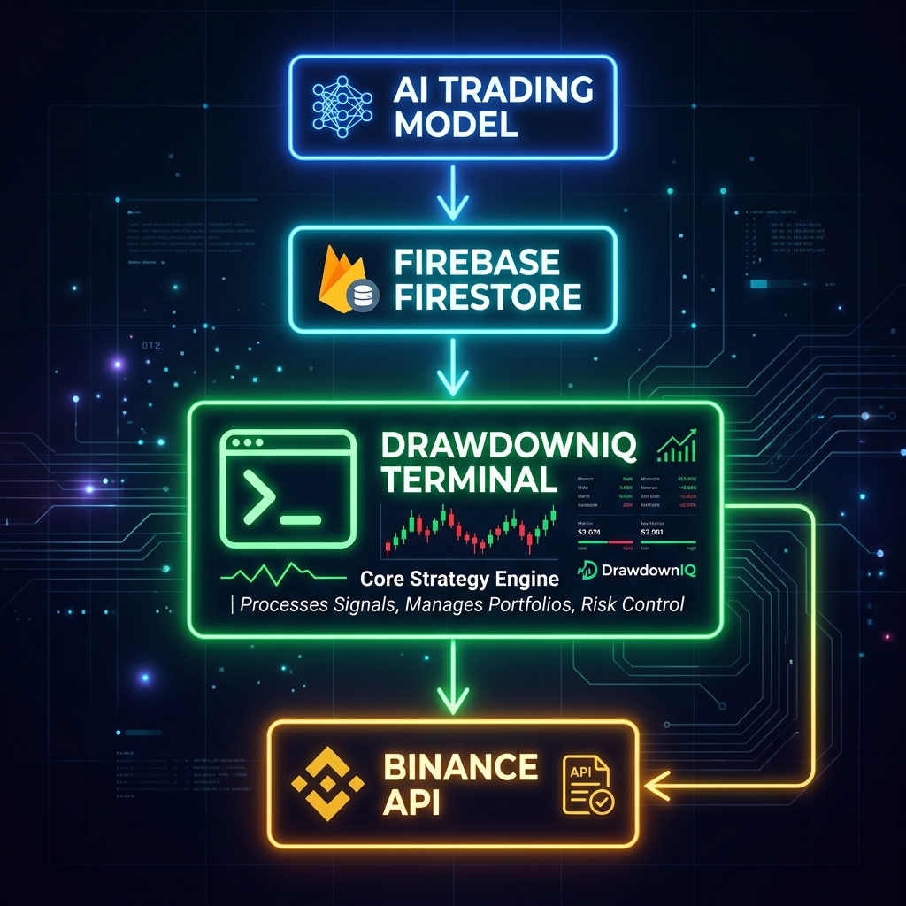

# DrawdownIQ - Quantitative Risk Intelligence

Welcome to **DrawdownIQ**, a high-performance quantitative trading terminal built for modern traders. The terminal provides real-time signal tracking, live PnL calculations, daily trading plans, and execution logs using a sleek, data-rich user interface.

<p align="center">
  
  
  
  
  
</p>

## ✨ Features
- **Real-Time Market Data**: Pulls live ticker prices directly from Binance API.
- **Signal Tracking**: Monitors running trades and actively compares them against Take Profit (TP) and Stop Loss (SL) targets.
- **Firestore Synchronization**: Uses `onSnapshot` listeners to sync live data securely and instantly across the platform.
- **Tier-Based Access**: Role-based rendering and unlocking mechanisms for Free, Signals, Trader, and Elite plans.
- **Sleek UI/UX**: Animations via Framer Motion, optimized layouts, and high-tech minimalist design.

---

## 🛠️ Getting Started

### Prerequisites
- [Node.js](https://nodejs.org/en/) installed.
- [npm](https://www.npmjs.com/) or [yarn](https://yarnpkg.com/).

### Installation

1. **Clone the repository**
   ```bash
   git clone https://github.com/aryanp160/drawdowniq-landing.git
   cd drawdowniq-landing
   ```

2. **Install dependencies**
   ```bash
   npm install
   ```

3. **Environment Setup**
   Create a `.env` file in the root directory and add the following keys:
   ```env
   VITE_BINANCE_API_URL="https://api.binance.com"
   VITE_FIREBASE_API_KEY="your-api-key"
   VITE_FIREBASE_AUTH_DOMAIN="your-auth-domain"
   VITE_FIREBASE_PROJECT_ID="your-project-id"
   VITE_FIREBASE_STORAGE_BUCKET="your-storage-bucket"
   VITE_FIREBASE_MESSAGING_SENDER_ID="your-messaging-sender-id"
   VITE_FIREBASE_APP_ID="your-app-id"
   VITE_FIREBASE_MEASUREMENT_ID="your-measurement-id"
   ```

4. **Run the Development Server**
   ```bash
   npm run dev
   ```

---

## 🏛️ Architecture

<div align="center">
  
</div>

DrawdownIQ follows a decoupled architecture where an external quantitative trading model continuously generates trading signals and writes them to Firebase Firestore. The React dashboard subscribes to Firestore using real-time `onSnapshot` listeners, enabling instant updates without polling. Live market prices are fetched from the Binance API to calculate current PnL and display execution progress.

---

## 💻 Tech Stack
- **Frontend Framework**: React 18, TypeScript, Vite
- **Styling**: Tailwind CSS, Framer Motion
- **Backend/Database**: Firebase Firestore, Firebase Authentication
- **External API**: Binance API (Real-time Market Data)

---

## 📂 Folder Structure

```text
drawdowniq-landing/
├── public/                 # Static assets (images, fonts, etc.)
└── src/
    ├── components/         # Reusable UI components
    │   ├── dashboard/      # Terminal-specific components (Grid, LiveSessionBar)
    │   ├── landing/        # Landing page marketing components
    │   └── ui/             # Primitive UI components (Buttons, Inputs)
    ├── contexts/           # React context providers (Auth, Theme)
    ├── hooks/              # Custom React hooks
    ├── lib/                # Utility configurations (firebase.ts, utils)
    ├── pages/              # Application routes (Index, Login, Pricing, Terminal)
    ├── App.tsx             # Root component and router
    └── main.tsx            # Application entry point
```

---

## 🗄️ Firebase Firestore Schemas

This application relies on the following core data structures in Firestore:

### 1. `users` Collection
Stores user authentication details and subscription tier logic.
```typescript
interface UserProfile {
  uid: string;
  email: string;
  plan: 'free' | 'signals' | 'trader' | 'elite';
  subscriptionStatus: 'active' | 'inactive' | 'past_due';
  expiresAt: Timestamp;
  createdAt: Timestamp;
}
```

### 2. `signals` Collection
The core trading intelligence data displayed inside the `DashboardGrid`.
```typescript
interface TradeSignal {
  id: string; // Document ID
  asset: string; // e.g. "BTC"
  direction: 'LONG' | 'SHORT';
  confidence: string; // e.g. "74%"
  entryLow: number;
  entryHigh: number;
  tp: number;
  sl: number;
  leverage: number; // Execution modifier (e.g., 5)
  status: 'RUNNING' | 'TP_HIT' | 'SL_HIT'; // Execution state
  validUntil: any; // Firestore Timestamp
  timestamp: any; // Firestore Timestamp
}
```

### 3. `dailyPlans` Collection
Premium execution plans for `Trader` and `Elite` tiers. Displayed prominently at the top of the terminal.
```typescript
interface DailyPlan {
  id: string; // Document ID
  date: string; // ISO String Date
  bias: 'Bullish' | 'Bearish' | 'Neutral';
  supportLevels: string[]; // ["$61,200", "$59,800"]
  resistanceLevels: string[]; // ["$63,500", "$65,000"]
  watchlist: string[]; // ["BTC", "SOL", "LINK"]
  riskMode: 'Low' | 'Medium' | 'High';
}
```

### Operating Instructions
1. **Real-time Engine**: The terminal UI strictly listens to these collections via `onSnapshot` queries. 
2. **Access Control**: Users must have `plan === 'trader' || plan === 'elite'` to view unblurred `dailyPlans`. 
3. **Seeding Data**: Simply creating documents matching this schema in the Firebase console will immediately reflect in the live terminal.

---

<p align="center">
  <i>DrawdownIQ - Built for professional market participants.</i>
</p>
